# Cell segmentation results

This report was generated from a completed run of the assignment-style U-Net. The split was fixed before training. Validation selected the checkpoint; the held out test set was evaluated once.

The split is source-disjoint: training uses Init, Melanoma, SN15, TScratch; validation uses Microfluidics, Scatter; and the held-out test uses HEK293, MDCK. This measures transfer to acquisition sources not seen during training.

## Configuration

| Setting | Value |
| --- | ---: |
| Dataset | BBBC019v2 |
| Input image size | 572 x 572 |
| Output mask size | 388 x 388 |
| Train / validation / test images | 120 / 19 / 26 |
| Epochs | 16 |
| Best validation epoch | 8 |
| Best validation Dice | 0.7150 |
| Batch size | 3 |
| Learning rate | 0.001 |
| Device | cuda |
| Training time | 453.6 seconds |

The network uses unpadded 3 x 3 convolutions, transpose-convolution upsampling, and center-cropped skip connections. No architecture deviation was used in this run. Images are grayscale and normalized to [0, 1]. Training augmentation uses horizontal and vertical flips, 90-degree rotations, zooming, and gamma correction.

## Loss and test metrics

The chart shows training and validation loss at every epoch. The horizontal test line is the single held out test evaluation, not a per-epoch test measurement.

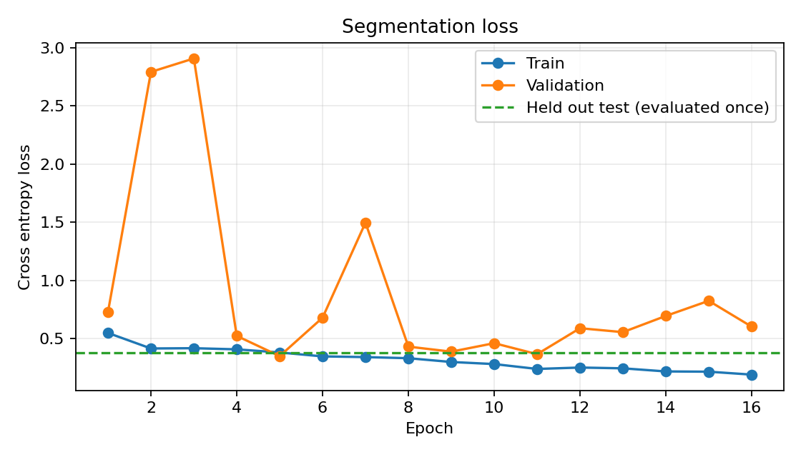

| Held out test metric | Value |
| --- | ---: |
| Cross entropy loss | 0.3803 |
| Pixel accuracy | 0.8579 |
| Dice | 0.8884 |
| Intersection over union | 0.7993 |
| Precision | 0.8588 |
| Recall | 0.9202 |
| Mean per-image Dice | 0.8897 |
| Test images | 26 |

## Performance by BBBC019 source

| Source | Images | Dice | IoU | Precision | Recall |
| --- | ---: | ---: | ---: | ---: | ---: |
| HEK293 | 12 | 0.8835 | 0.7914 | 0.7945 | 0.9951 |
| MDCK | 14 | 0.8922 | 0.8053 | 0.9149 | 0.8706 |

## Result interpretation

The aggregate and mean per-image Dice scores are close (0.8884 and 0.8897), and performance is similar across the two held-out sources. Per-image Dice ranges from 0.6577 to 0.9776. HEK293 has near-perfect recall with lower precision, which reflects over-segmentation on some images. The weakest MDCK cases have high precision with low recall, which reflects under-segmentation.

Validation Dice peaked at epoch 8. Validation loss became unstable afterward while training loss continued to decrease, so the selected epoch-8 checkpoint is the appropriate model to report. The result demonstrates useful transfer to two unseen acquisition sources, but the held-out set has only 26 images and should be presented as a portfolio baseline rather than a state-of-the-art claim.

## Dataset attribution

This experiment uses [BBBC019v2](https://bbbc.broadinstitute.org/BBBC019) from the Broad Bioimage Benchmark Collection. The official page catalogs 171 manually segmented DIC microscopy images across eight source datasets. This run used 165 verified image-mask pairs: 120 for training, 19 for validation, and 26 for testing. The dataset is licensed under CC BY 3.0, and its source files are not redistributed here.

## Test segmentations

Each preview shows the centered scan crop, ground-truth mask, and prediction from left to right.

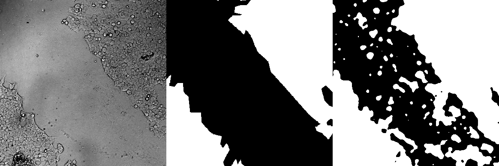
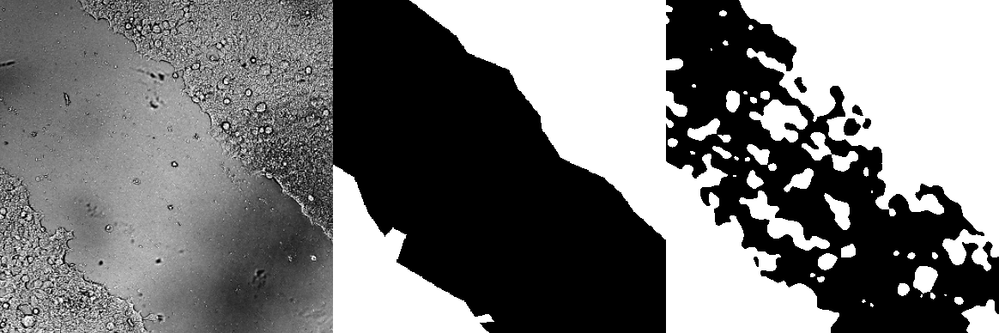
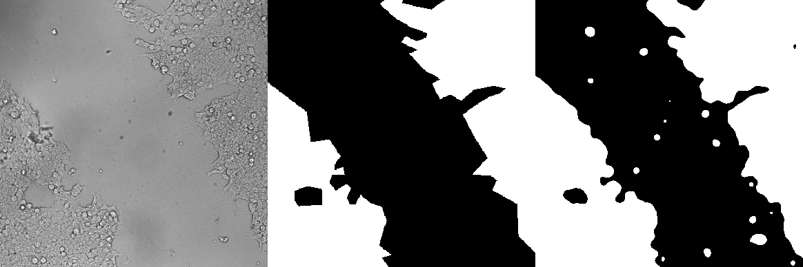
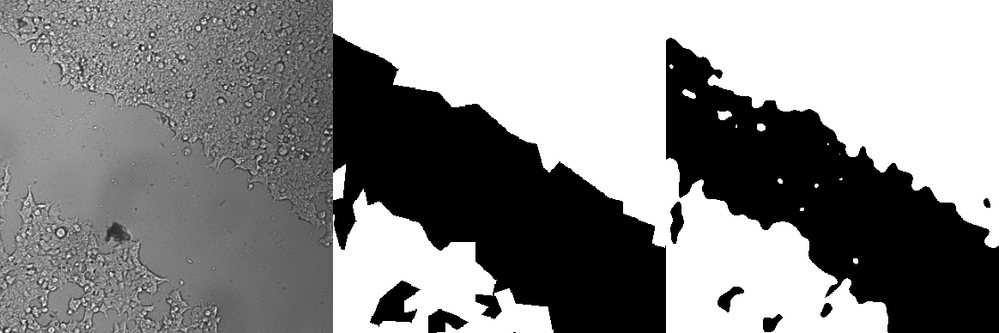
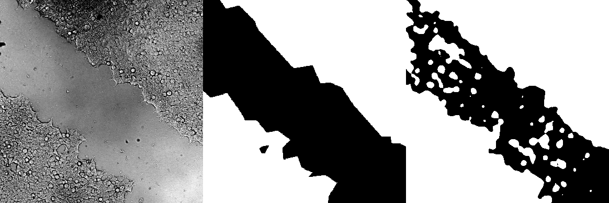
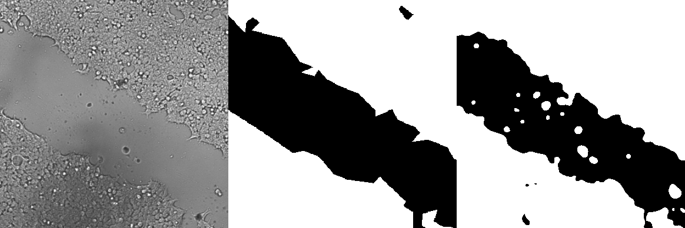
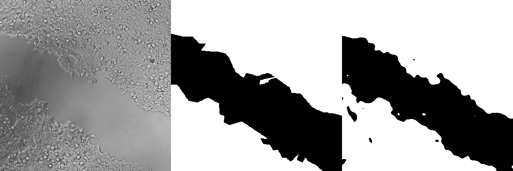
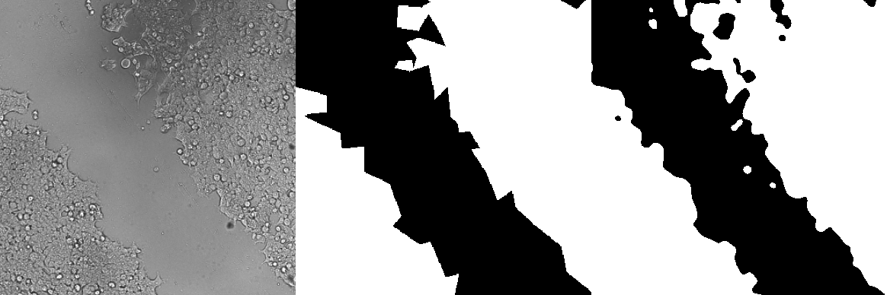
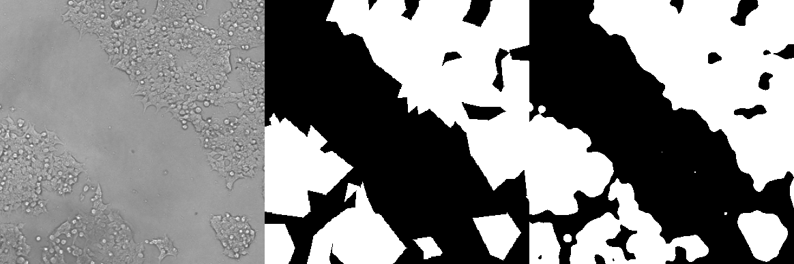
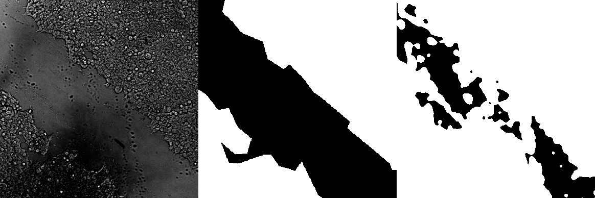
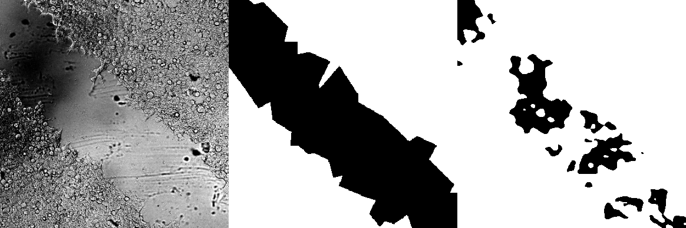
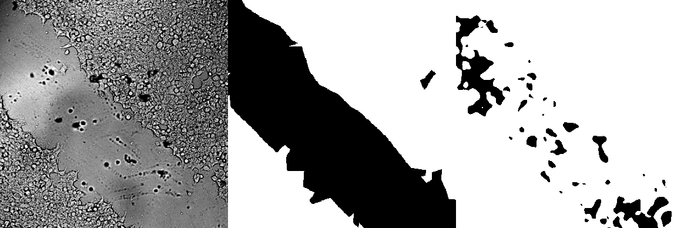

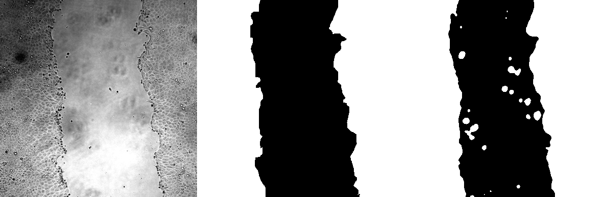
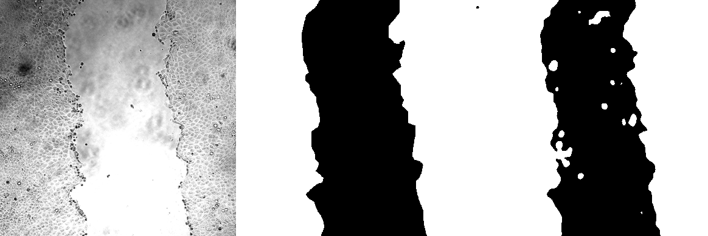
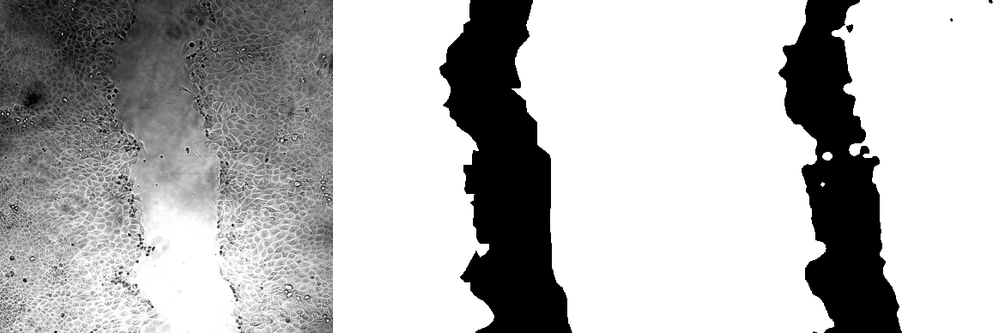
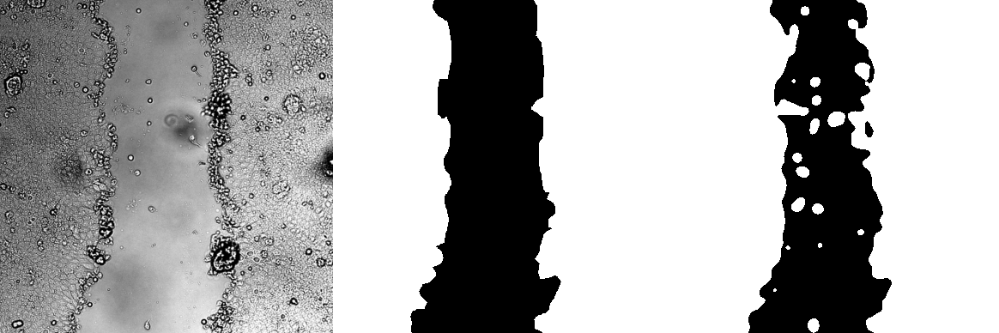
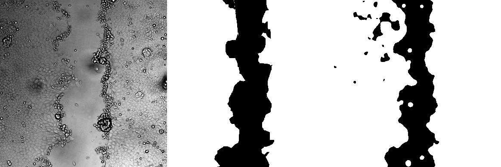
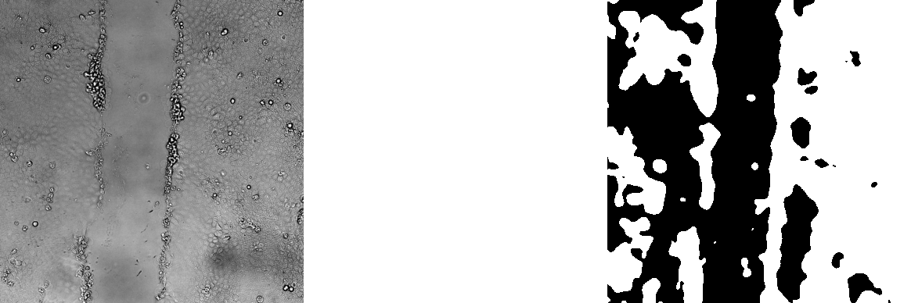
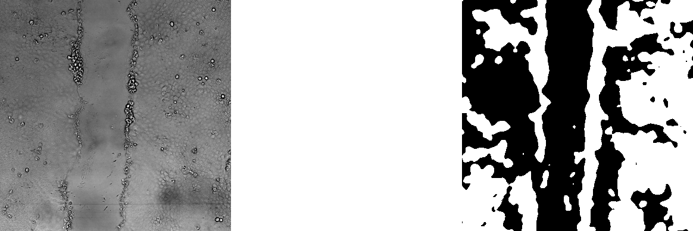
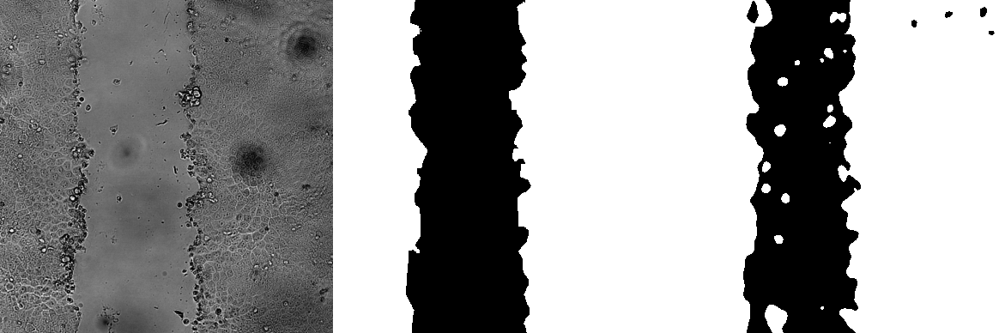
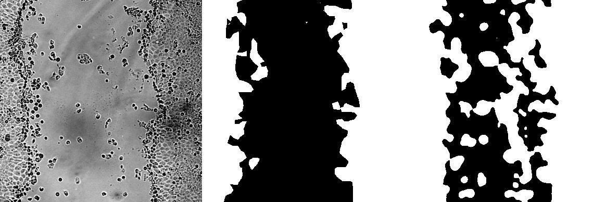
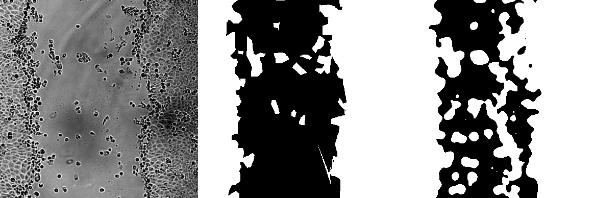
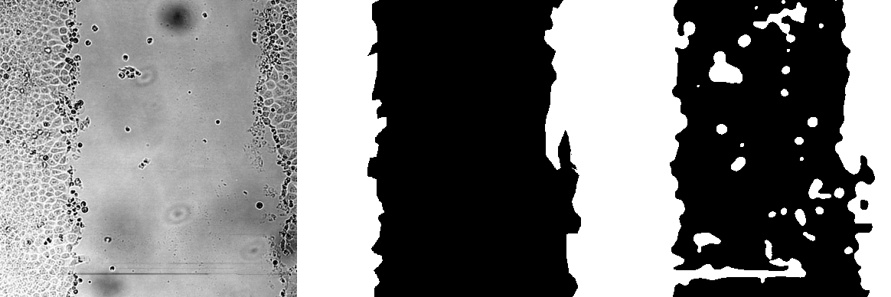
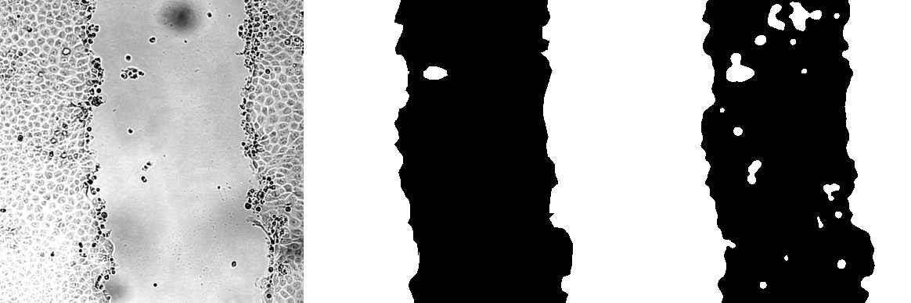
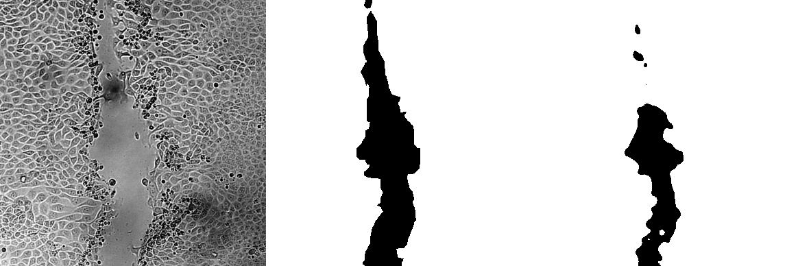

Raw artifacts: [`metrics.json`](metrics.json), [`per_image_metrics.csv`](per_image_metrics.csv), [`history.json`](history.json), and [`training_summary.json`](training_summary.json). The training summary records the split strategy, source assignments, counts, seed, configuration, and selected checkpoint. The exact file-level `split.json` was not present in this uploaded result folder; the corrected notebook now copies it into future exports.
