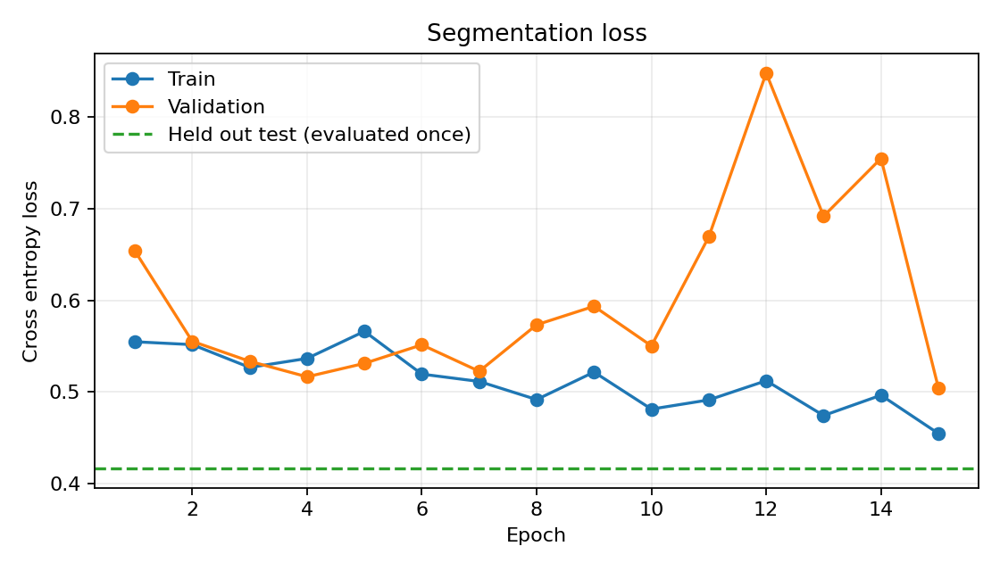
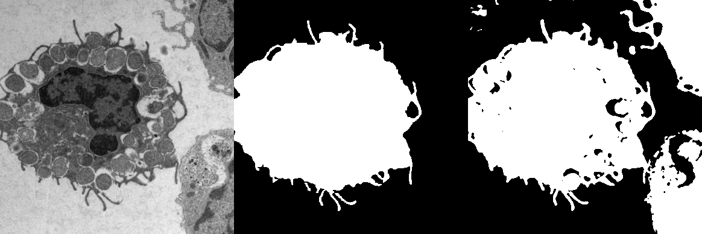
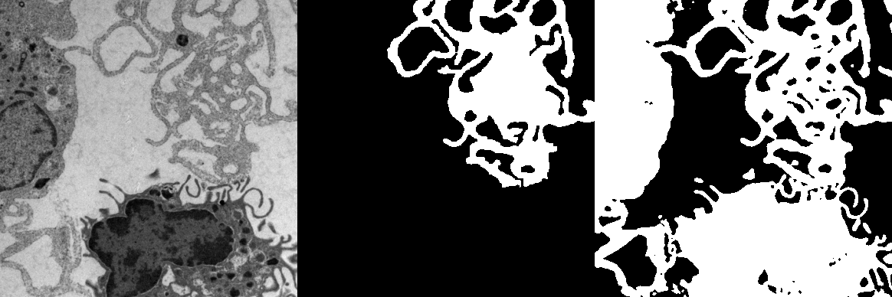
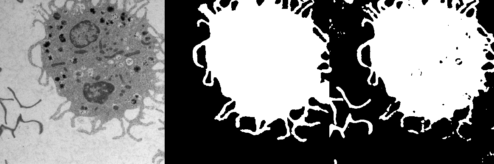
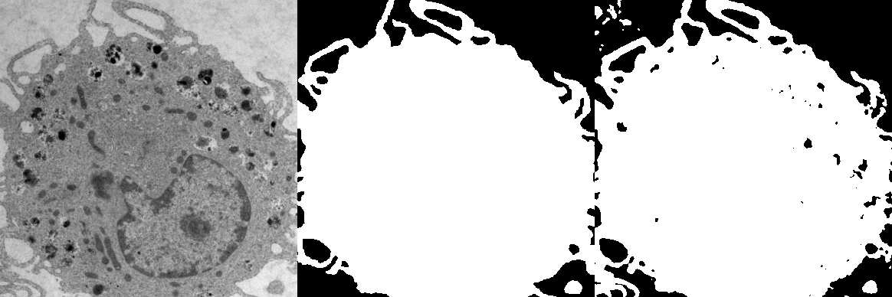

# Cell segmentation results

This report was generated from a completed run of the assignment-style U-Net. The split was fixed before training. Validation selected the checkpoint; the held out test set was evaluated once.

## Configuration

| Setting | Value |
| --- | ---: |
| Input image size | 572 x 572 |
| Output mask size | 388 x 388 |
| Train / validation / test images | 30 / 4 / 4 |
| Epochs | 15 |
| Best validation epoch | 15 |
| Batch size | 3 |
| Learning rate | 0.001 |
| Device | cuda |
| Training time | 98.9 seconds |

The network uses unpadded 3 x 3 convolutions, transpose-convolution upsampling, and center-cropped skip connections. No architecture deviation was used in this run. Images are grayscale and normalized to [0, 1]. Training augmentation uses horizontal and vertical flips, 90-degree rotations, zooming, and gamma correction.

## Loss and test metrics

The chart shows training and validation loss at every epoch. The horizontal test line is the single held out test evaluation, not a per-epoch test measurement.

| Held out test metric | Value |
| --- | ---: |
| Cross entropy loss | 0.4171 |
| Pixel accuracy | 0.8189 |
| Dice | 0.8290 |
| Intersection over union | 0.7080 |
| Test images | 4 |

## Test segmentations

Each preview shows the centered scan crop, ground-truth mask, and prediction from left to right.

The split, complete epoch history, and raw metrics are saved in `split.json`, `history.json`, and `metrics.json` for reproducibility.
